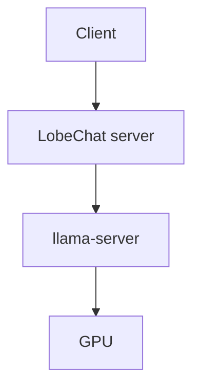

# LobeChat: простые сценарии

Базовые сценарии использования LobeChat на Strix Halo. Предполагается что LobeChat установлен через [`scripts/webui/lobe-chat/install.sh`](../../../scripts/webui/lobe-chat/install.sh) и запущен на `http://<SERVER_IP>:3211`.

## Предусловия

1. **Inference backend запущен**: llama-server слушает на `localhost:8081` (или настроен через `~/.config/ai-plant/inference.env`)
2. **LobeChat контейнер запущен**: [`scripts/webui/lobe-chat/start.sh`](../../../scripts/webui/lobe-chat/start.sh)
3. **Веб-UI доступен**: `http://<SERVER_IP>:3211`

## 1. Первый запуск: подключение к локальному llama-server

**Задача**: настроить LobeChat на использование локальной модели через llama-server.

### Шаги

1. Открыть `http://<SERVER_IP>:3211`
2. При первом запуске LobeChat работает в **client-mode** (без database), данные хранятся локально в browser
3. Если настроен server-mode с auth -- зарегистрироваться
4. Перейти в Settings (иконка шестерёнки в левом нижнем углу)
5. Settings → Language Model → "Custom Provider" или "OpenAI" (они совместимы)
6. Заполнить:
   - **API Key**: `dummy` (что угодно, llama-server не проверяет)
   - **API Base URL**: `http://<SERVER_IP>:8081/v1`
   - **Model List**: добавить вручную названия моделей, например `qwen3-coder-next`, `qwen3.5-122b-a10b` (или оставить auto-fetch через `/v1/models`)
7. Save

### Проверка

1. Вернуться в главный чат (иконка chat в левой панели)
2. В dropdown моделей вверху выбрать подключённую модель
3. Написать "Привет!"
4. Должен прийти стриминговый ответ

Если не работает -- проверить:
- llama-server запущен: `curl http://localhost:8081/v1/models`
- `API Base URL` правильный (обязательно `/v1` в конце)
- Модель действительно есть (название в llama-server должно совпадать)

### Что происходит

LobeChat клиент (browser или Electron) делает запросы к своему Next.js server, тот проксирует в llama-server, получает SSE stream, стримит обратно в клиент через WebSocket или server-sent events.

## 2. Переключение между провайдерами и моделями

**Задача**: в одном UI использовать и локальную модель на Strix Halo, и Claude cloud для сложных задач.

### Шаги

1. Settings → Language Model
2. Activate OpenAI (локальный llama-server) с настройками из предыдущего сценария
3. Activate Anthropic: API Key из Anthropic console
4. Save

Теперь в dropdown моделей показываются обе: локальный `qwen3-coder-next` и cloud `claude-opus-4.5`. Переключение -- один клик в dropdown.

### Зачем

Типичный workflow:
- **Локальная модель** -- для privacy-sensitive задач, для batch-работы, для простых вопросов
- **Cloud (Claude/GPT)** -- для сложного reasoning где frontier-модель даёт лучшее качество

В одном UI не нужно ходить между приложениями. История чатов сохраняется для каждого провайдера.

## 3. Использование готового Agent из marketplace

**Задача**: найти готового "code reviewer" agent в Plugin Market и использовать его для ревью своего кода.

### Шаги

1. В sidebar слева найти секцию "Assistant Market" (иконка маркета)
2. Поиск: "code review"
3. Выбрать популярный agent, например "Code Quality Reviewer" (или похожий)
4. Кликнуть "Add to My Agents"
5. В списке агентов появляется новый
6. Кликнуть на agent → открывается новый чат с заранее настроенным system prompt
7. Вставить свой код в чат: "Please review this Python code: ```python ...```"
8. Agent отвечает в формате, который заложен в его system prompt (correctness, security, style, etc)

### Почему это удобно

Вместо того чтобы писать system prompt самому, используешь готовый и проверенный community-контрибьютерами промпт. Marketplace курирует качественных агентов.

### Где хранится

Agent definition -- это JSON с system prompt, description, avatar, parameters. Хранится локально в IndexedDB (client-mode) или в PostgreSQL (server-mode). Можно отредактировать после import'а.

## 4. Красивый markdown рендеринг: code, таблицы, math

LobeChat имеет **продуманный markdown рендеринг**:

### Code blocks

Все языки с syntax highlighting. Поддержка:
- **Copy button** в правом верхнем углу каждого code block
- **Line numbers** (опционально в настройках)
- **Wrap long lines** (опционально)
- **Language detection** автоматическое если не указано

Пример промпта: "Напиши реализацию quicksort на Rust" -- ответ будет красиво форматирован с Rust syntax highlighting.

### Таблицы

Markdown таблицы рендерятся как HTML-таблицы с hover states и responsive behavior. Промпт: "Сравни Python и Rust в виде таблицы" -- табличный ответ читается гораздо лучше чем plain text.

### Math (LaTeX)

Inline: `$f(x) = x^2$`
Block:
```
$$
\int_0^\infty e^{-x^2} dx = \frac{\sqrt{\pi}}{2}
$$
```

Рендерится через KaTeX -- быстрее чем MathJax, красивее чем plain text.

### Mermaid diagrams

````

````

Блоки с `mermaid` рендерятся как SVG-диаграммы. LobeChat один из немногих chat-UI с native Mermaid support.

### Пример использования

Промпт: "Объясни архитектуру web-приложения с diagram'ой":
- Модель отвечает текстом + mermaid diagram
- LobeChat рендерит всё в одном view
- Можно скачать diagram отдельно

## 5. Voice input (через browser Whisper или cloud STT)

**Задача**: надиктовать промпт вместо набора.

### Шаги

1. В поле ввода справа кликнуть иконку микрофона
2. Разрешить доступ к микрофону (browser prompt)
3. Говорить
4. Остановить запись (повторный клик)
5. Транскрипт появляется в поле ввода
6. Отредактировать при необходимости и отправить

### Провайдеры STT

LobeChat поддерживает несколько STT (speech-to-text) провайдеров:
- **OpenAI Whisper API** (cloud) -- default, качественно, платно
- **Browser Web Speech API** -- native в Chrome/Edge, бесплатно но качество хуже
- **Local Whisper** (через HF Transformers.js) -- работает в browser через WebAssembly, бесплатно, среднее качество
- **Cloud Whisper через Ollama/llama-server** -- если локально развёрнут whisper.cpp

Settings → Speech Recognition → выбрать provider.

## 6. Impact Agent: реакция на plugin output

**Задача**: задать вопрос agent'у с подключённым плагином, увидеть как он использует plugin.

### Пример

1. Settings → Plugins → установить "Web Search" plugin из маркета
2. В новом чате выбрать модель с tool calling support (Qwen3, Llama 3.2, Mistral Nemo)
3. Активировать Web Search plugin в настройках чата
4. Промпт: "Какая сейчас погода в Москве?"

### Что происходит

1. Модель видит описание tool `web_search` в запросе
2. Генерирует tool call: `web_search(query="weather in Moscow")`
3. LobeChat вызывает plugin's API endpoint (обычно serverless function)
4. Plugin возвращает результат поиска
5. Модель получает результат как system message и формулирует финальный ответ

В UI видно:
- Загорается иконка plugin'а (показывает что он вызван)
- Появляется свёрнутый блок "Web search: weather in Moscow" -- можно развернуть и увидеть raw результат
- После этого финальный ответ модели с данными о погоде

### Полезные plugins из маркета

- **Web Search** -- Google/Bing/DuckDuckGo search
- **Wikipedia** -- lookup статей
- **Math Solver** -- решение математических задач
- **Image Generation** -- DALL-E / SD через API
- **Bilibili**, **YouTube** -- info о видео
- **GitHub** -- repository lookup
- **Arxiv** -- academic papers

## 7. Сохранение и экспорт чата

**Задача**: экспортировать интересный чат в Markdown или JSON для сохранения.

### Экспорт в Markdown

1. Кликнуть меню чата (три точки) → Export → Markdown
2. Скачивается `.md` файл с форматированной историей

### Экспорт в JSON

1. Кликнуть меню → Export → JSON
2. Файл с полной структурой (messages, metadata, settings)

### Import обратно

Settings → Data Management → Import Chat → выбрать файл. История восстановится как новый чат.

### Зачем

- Сохранение важных reference-чатов
- Share с коллегами (отправить `.md` в slack/email)
- Backup перед очисткой browser data (в client-mode)
- Документация (архитектурные обсуждения с LLM -- ценный артефакт)

## 8. Favorite и organization чатов

### Pinning

Right-click на чат в sidebar → Pin. Закреплённый чат всегда вверху списка.

### Folders / Groups

Settings → Chat Organization → Create Folder → перетащить чаты в folder.
Полезно для разделения:
- "Работа / Coding"
- "Learning / Study"
- "Personal / Hobby"

### Search по истории

Глобальный search (Cmd+K / Ctrl+K) -- ищет по всей истории чатов. Полезно когда что-то обсуждал "месяц назад", не помнишь где.

## Связанные статьи

- [README.md](README.md) -- обзор профиля
- [introduction.md](introduction.md) -- что это, история, философия
- [architecture.md](architecture.md) -- внутреннее устройство
- [advanced-use-cases.md](advanced-use-cases.md) -- Plugin Market глубоко, custom agents, background tasks
- [../open-webui/simple-use-cases.md](../open-webui/simple-use-cases.md) -- аналогичные паттерны в Open WebUI
- [../../../scripts/webui/README.md](../../../scripts/webui/README.md) -- скрипты управления
